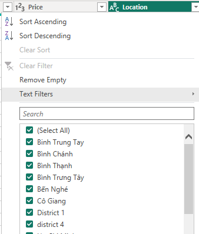

# Phân Tích Dữ Liệu Airbnb TPHCM: Giá Thuê, Loại Căn Hộ và Phân Bố 
## 1. Giới thiệu về dự án
Dự án này tập trung vào việc phân tích dữ liệu về các căn hộ được thuê qua Airbnb tại TPHCM. Dữ liệu bao gồm các thông tin như giá thuê, số lượng phòng (phòng khách, phòng ngủ, phòng tắm), số giường ngủ và điểm đánh giá của mỗi căn hộ. Bằng cách khai thác và trực quan hóa dữ liệu này, dự án nhằm mang lại cái nhìn tổng quan về thị trường thuê căn hộ Airbnb trong khu vực, giúp khách hàng có nhu cầu thuê căn hộ dễ đưa ra quyết định hơn.

## 2. Mục tiêu của dự án
- Thu thập dữ liệu từ trang web của airbnb và làm sạch dữ liệu.
- Phân tích sự phân bổ của các loại căn hộ theo từng khu vực (quận) trong thành phố.
- Xác định loại căn hộ phổ biến nhất.
- Trực quan hóa dữ liệu bằng Power BI để đưa ra những thông tin quan trọng.

## 3. Lấy dữ liệu
[Code lấy dữ liệu sử dụng Selenium](Sele.py)

## 4. Làm sạch dữ liệu bằng PowerQuery
###  - Loại bỏ các dòng không có Price và chuyển định dạng cột Price về kiểu số

###  - Chuẩn hóa cột Location

+ Bình Trưng Tây, Binh Trung Tay, Thành Phố Thủ Đức, Long Bình -> Thủ Đức
+ Tân An Hội -> Củ Chi
+ Nguyễn Thái Bình, Đa Kao, Công Giang, Bến Nghé, District 1 -> Quận 1
+ Thảo Điền -> Quận 2
+ District 4 -> Quận 4
+ Tân Hưng -> Quận 7
+ Còn lại -> Other

###  - Chuẩn hóa cột Rate
+ Chuyển cột Rate về dạng số thực
+ Thay giá trị NA bằng trung bình cột Rate (4.38)

###  - Tạo cột Type (loại phòng) bằng cách ghép 4 cột LivingRoom, Bedroom, Bed, Bath

### [- Dữ liệu sau khi làm sạch](clean_listroom.csv)

## 4. Tạo Dashboard để trực quan bằng PowerBI

